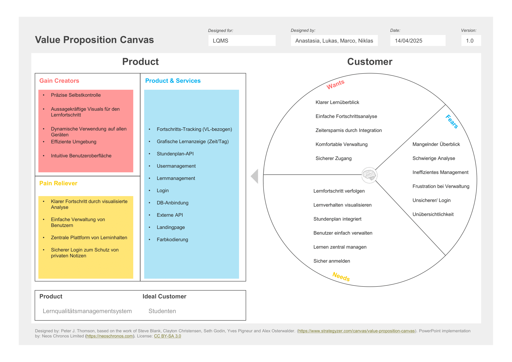
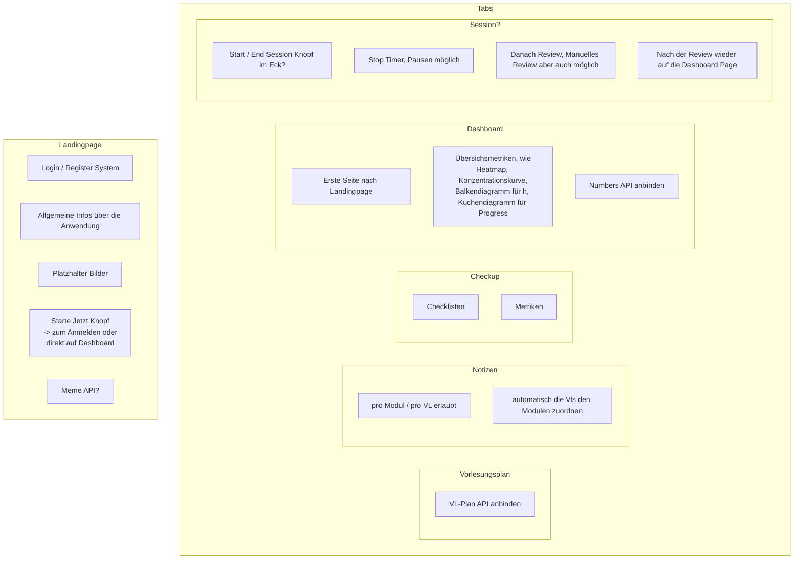
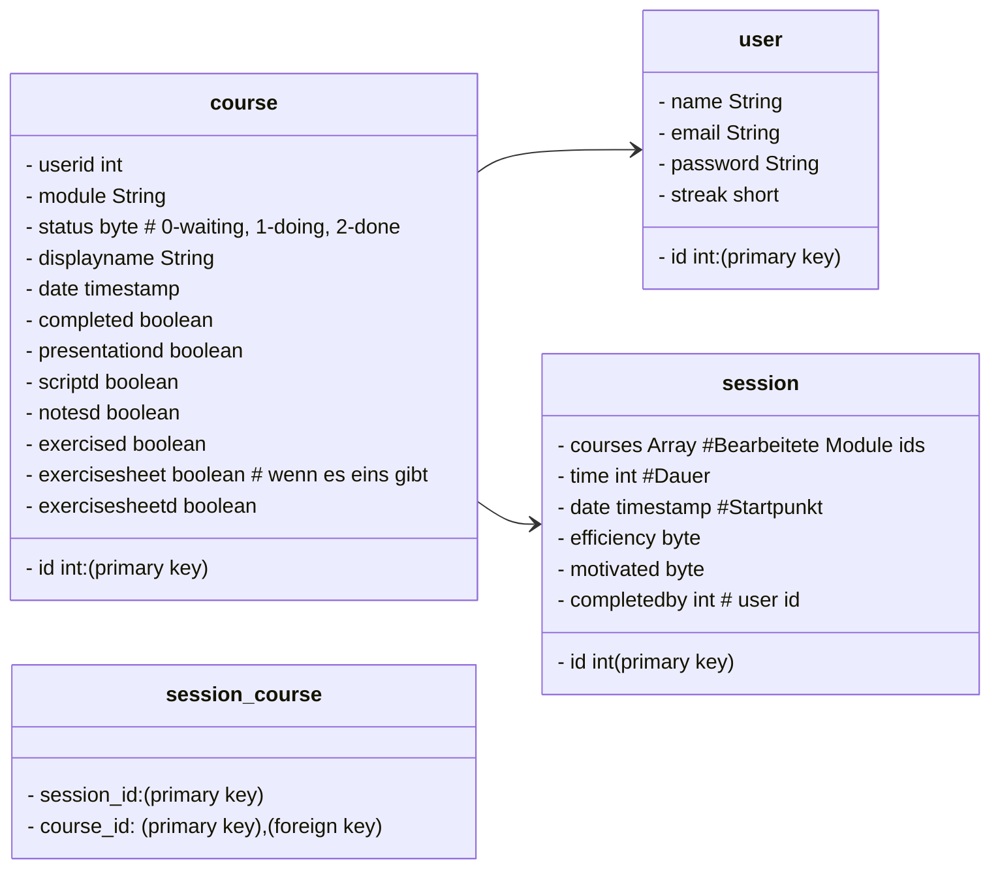
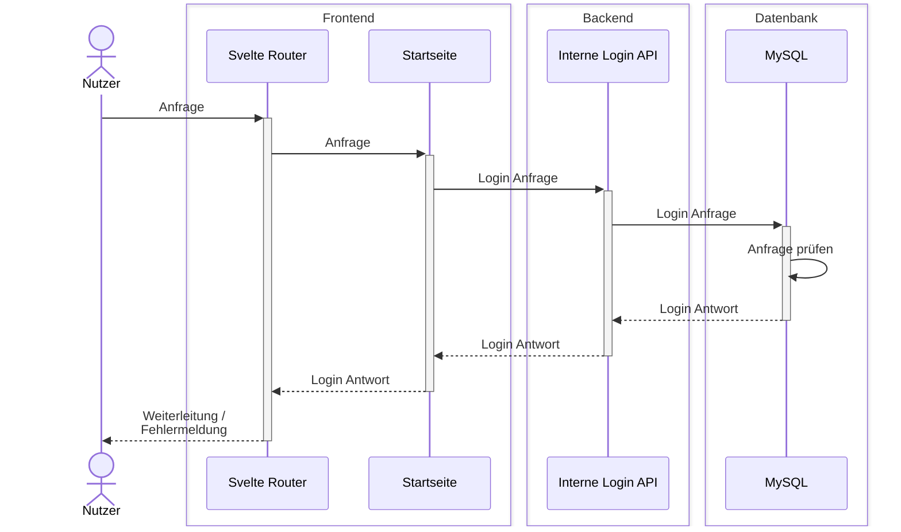
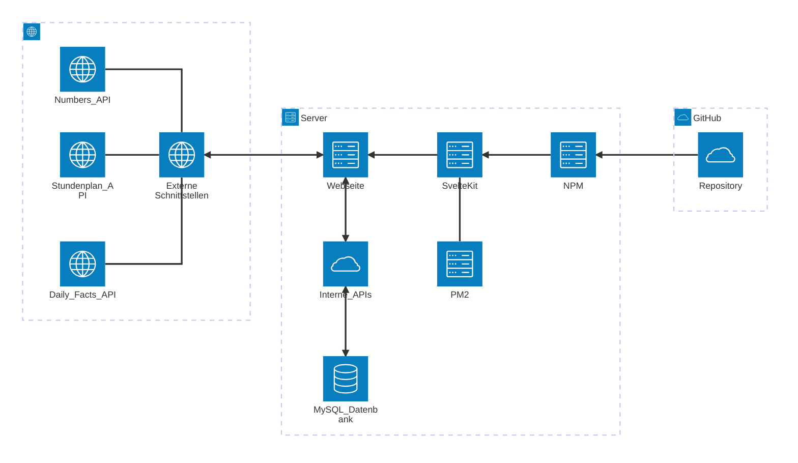

---

# Lern-Qualitäts-Management-System

# Konventionen für Commit-Nachrichten

- `feat`: Ein neues Feature (Funktion)
- `fix`: Ein Bugfix (Fehlerbehebung)
- `docs`: Änderungen ausschließlich an der Dokumentation
- `style`: Änderungen, die keine Auswirkungen auf die Funktionalität des Codes haben (z. B. Leerzeichen, Formatierung, fehlende Semikola usw.)
- `refactor`: Änderungen am Code, die weder Fehler beheben noch neue Features hinzufügen
- `perf`: Änderungen am Code zur Leistungsverbesserung
- `test`: Hinzufügen fehlender Tests
- `chore`: Änderungen am Build-Prozess oder an unterstützenden Tools und Bibliotheken (z. B. zur Dokumentationserstellung)

# Value Proposition Canvas

## Value Map (Wertangebot)

- **Nutzenstifter** (wie das Produkt bzw. der Service dem Kunden einen Mehrwert bietet)
- **Schmerzlinderer** (wie das Produkt bzw. der Service die Probleme oder Schmerzen des Kunden lindert)
- **Produkte und Services** (Produkte/Dienstleistungen, die dem Kunden helfen, seine Aufgaben zu erledigen)

## Kundenprofil

- **Gewinne** (was der Kunde erreichen will / sich erhofft)
- **Zu erledigende Aufgaben** (Aufgaben, Probleme, Bedürfnisse des Kunden)
- **Schmerzen** (Hindernisse, Risiken oder negative Erfahrungen im Zusammenhang mit den Aufgaben)

# Aufbau Ideen Sammlung

# Entitäten-Übersicht

# Login Prozess Diagram

# Architektur Diagram

